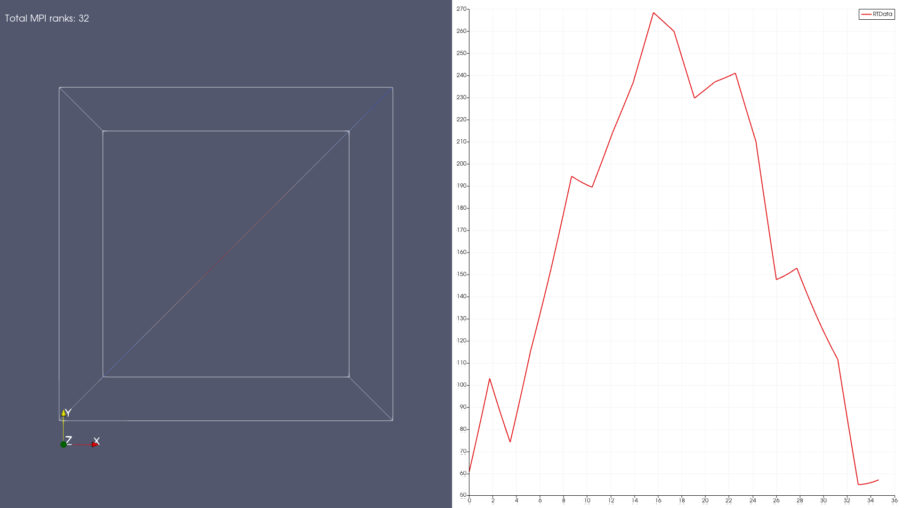

# MPI + GPUs in Containerized Applications on AzHOP

The basic use-case is simple: we want to run a containerized application that uses MPI on a cluster setup using [AzHOP].
We want to ensure that the containerized application is able to use the correct interconnect available on the cluster.
Secondly, we want to ensure that the containerized application is able to use the GPUs available on the cluster for rendering.

To make the use-case more concrete, let's say we want to run containerized [ParaView] batch client on a cluster setup using AzHOP.

## Building the container

This repository contains a script to build the container image. We build two separate sets of containers, with and without GPU-accelerated rendering.

To build the containers, run the following command:

```bash
# tag_suffix is optional and if provided, will be appended to the container tag
./build_container.sh <container_name> [tag_suffix]
```

To optionally push the containers to container registry such as Docker Hub or Azure Container Registry, run the following command:

```bash
# build and push container images
./build_container.sh --push <container_name> [tag_suffix]
```

The default registry is docker.io, to change it, fully qualify the container name
e.g. `myacr.io/utkarshayachit/container-playground`.

This creates four container images with the following tags:

1. `<container_name>:<mpi-impl>[tag_suffix]`
1. `<container_name>:<mpi-impl>-glvnd[tag_suffix]` *-- needs GPUs on host*
1. `<container_name>:pv-osmesa[tag_suffix]`
1. `<container_name>:pv-egl[tag_suffix]` *-- needs GPUs on host*

Where:

* `container_name` and `tag_suffix` are the arguments passed to the script
* `mpi-impl` is one of `mpich`, `hpcx` or `mpich+hpcx` which is based on which MPI implementation(s)
   is (are) enabled by passing optional arguments to the script.

Command line options to the `build_container.sh` script are:

```bash
> ./build_containers.sh --help

Usage: ./build_containers.sh [OPTIONS] <container_name> [tag_suffix]

Options:
  -h, --help      Show this help message and exit
  -p, --push      Push the container to the registry
  --hpcx          Build the container with HPC-X
  --no-hpcx       Do not build the container with HPC-X (default)
  --mpich         Build the container with MPICH (default)
  --no-mpich      Do not build the container with MPICH
  --paraview      Build the container with ParaView (requires --mpich) (default)
  --no-paraview   Do not build the container with ParaView
```

## Running the container on AzHOP

The container images are meant to be run on a cluster setup using [AzHOP] with [SLURM] as the job scheduler. PBS is currently not supported. We use [Pyxis] / [Enroot] to run the container images in a SLURM job with MPI.

Following are examples of running the tests in various configurations. To submit the job, run the following commands must be run
in the shell on [Code Server], [Linux Desktop], or [Jupyter] on the cluster. These cannot be run from the [Cluster Shell Access]
available in the OnDemand portal.

### Validating MPI setup

Let's first run some basic benchmarks to ensure that the MPI setup is working correctly. The containers include [OSU benchmarks]
and [Intel MPI Benchmarks]. Both of these benchmarks are run using scripts under `/opt/launchers` in the container.
`/opt/launchers/osu.sh` can be used to execute an OSU benchmark, and `/opt/launchers/imb.sh` can be used to execute an IMB benchmark.

Both these scripts take the name of the benchmark as the first argument, and the arguments to the benchmark executable as
the rest of the arguments, if any. For example, to run the `osu_bibw` benchmark, we can run the following command:

```bash
# OSU benchmark: osu_bibw on single node
srun -N 1 -n 2 --mpi=pmix -p hbv3u18                      \
  --container-image=$container_name:$mpi_impl$tag_suffix  \
  /opt/launchers/osu.sh osu_bibw

# OSU benchmark: osu_bibw on 2 nodes
srun -N 2 -n 2 --mpi=pmix -p hbv3u18                      \
--container-image=$container_name:$mpi_impl$tag_suffix    \
/opt/launchers/osu.sh osu_bibw
```

For Intel MPI benchmarks, to run the `ping-pong` benchmark, we can run the following commands:

```bash
# IMB benchmark: pingpong on single node
srun -N 1 -n 2 --mpi=pmix -p hbv3u18                      \
  --container-image=$container_name:$mpi_impl$tag_suffix  \
  /opt/launchers/imb.sh IMB_MPI1 PingPong

# IMB benchmark: pingpong on 2 nodes
srun -N 2 -n 2 --mpi=pmix -p hbv3u18                      \
  --container-image=$container_name:$mpi_impl$tag_suffix  \
  /opt/launchers/imb.sh IMB_MPI1 PingPong
```

The scripts run the requested benchmark using each of the MPI implementations available in the container. For containers with
both MPICH and HPC-X, i.e. where the `mpi_mpl` is `mpich+hpcx`, you can pick one of the implementations by passing either `--mpich`
or `--hpcx` as the first argument to the script.

Here's a sample output of the ping-pong benchmark running on 2 nodes:

```python
> srun -N 2 -n 2 --mpi=pmix -p hbv3u18                          \
    --container-image=utkarshayachit/container_playground:mpich \
    /opt/launchers/imb.sh IMB_MPI1 PingPong

# <...snip...>

#---------------------------------------------------
# Benchmarking PingPong
# #processes = 2
#---------------------------------------------------
       #bytes #repetitions      t[usec]   Mbytes/sec
            0         1000         1.78         0.00
            1         1000         1.77         0.56
            2         1000         1.77         1.13
            4         1000         1.78         2.25
            8         1000         1.77         4.51
           16         1000         1.78         8.98
           32         1000         1.93        16.58
           64         1000         1.97        32.56
          128         1000         2.04        62.78
          256         1000         2.59        98.72
          512         1000         2.65       193.29
         1024         1000         2.75       371.73
         2048         1000         2.96       692.71
         4096         1000         3.67      1114.95
         8192         1000         4.08      2006.38
        16384         1000         5.37      3053.25
        32768         1000         9.43      3475.54
        65536          640        10.86      6035.49
       131072          320        13.61      9630.30
       262144          160        18.88     13885.77
       524288           80        29.74     17629.59
      1048576           40        51.03     20547.05
      2097152           20        93.52     22425.03
      4194304           10       178.50     23496.86


# All processes entering MPI_Finalize
```

#### **Debugging notes:**

* Don't forget to use `--mpi=pmix` to enable MPI support using pmix. This is required to run MPI jobs for containerized
  applications. The MPI impementation inside the containers must also be built with `pmix` support. This is the reason
  by the container images are built with MPICH from source with `pmix` support enabled.

* The launch command for the executable does not need to do `mpirun`. The executable will be launched on each rank
  and the `MPI_Init` call will take care of the rest.

* Add `--export=ALL,UCX_LOG_LEVEL=info,UCX_PROTO_INFO=y,UCX_PROTO_ENABLE=y` to the `srun` command to enable
  UCX logging. This is useful to debug UCX issues. Also helps determine if the correct interconnect is being used.

* If bandwidth numbers are low especially when running jobs across multiple nodes, ensure that SKU you're running on
   RDMA-capable. You can check this by running `ibv_devinfo` on the compute nodes. If the output shows
   no IB devices are found, then the SKU is not RDMA-capable.

### Validating GPU setup

The easiest way to verify that the GPU setup is working correctly is to run `nvidia-smi`  on the compute nodes from within
the container.

```bash
> srun -N 1 -n 1 --gpus=1 -p viz3d --container-image=$container_name:mpich-glvnd$tag_suffix nvidia-smi

# output
pyxis: importing docker image: utkarshayachit/container_playground:pv-egl
Mon Feb 27 19:23:14 2023
+-----------------------------------------------------------------------------+
| NVIDIA-SMI 470.82.01    Driver Version: 470.82.01    CUDA Version: N/A      |
|-------------------------------+----------------------+----------------------+
| GPU  Name        Persistence-M| Bus-Id        Disp.A | Volatile Uncorr. ECC |
| Fan  Temp  Perf  Pwr:Usage/Cap|         Memory-Usage | GPU-Util  Compute M. |
|                               |                      |               MIG M. |
|===============================+======================+======================|
|   0  Tesla M60           Off  | 00000001:00:00.0 Off |                  Off |
| N/A   31C    P8    15W / 150W |     47MiB /  8129MiB |      0%      Default |
|                               |                      |                  N/A |
+-------------------------------+----------------------+----------------------+

+-----------------------------------------------------------------------------+
| Processes:                                                                  |
|  GPU   GI   CI        PID   Type   Process name                  GPU Memory |
|        ID   ID                                                   Usage      |
|=============================================================================|
|    0   N/A  N/A     13267      G   /usr/bin/X                         36MiB |
|    0   N/A  N/A     13328      G   /usr/bin/gnome-shell                8MiB |
+-----------------------------------------------------------------------------+
```

By default, `viz3d` partition is setup to use `Standard_NV12s_v3` SKUs. These SKUs have 1 GPUs each. The `--gpus=1` option is required
to ensure that the GPU is allocated to the job.

### Notes on the MPI Implementation

The MPI implementation used in the container is MPICH. The `build_containers.sh` script also supports building containers
with HPC-X by passing the `--hpcx` flag. This will ensure that the container images built have both MPICH and HPC-X installed.
You can disable MPICH by passing the `--no-mpich` flag. This is useful if you want to build a container with only HPC-X. However, note
ParaView requires MPICH. The prebuilt ParaView binaries rely on MPICH ABI compatibility to use platform MPI implementation. Since HPC-X
does not support MPICH ABI compatibility, the prebuilt ParaView binaries will not work with HPC-X. This is why the container images
are built with MPICH by default. If `--no-mpich` is passed, then `--no-paraview` must also be passed to ensure that ParaView containers
are skipped as well.

If your application requires a different MPI implementation, you can build your own container image with the MPI implementation.
A couple of things to keep in mind:

1. The MPI implementation must be built with [pmix] support. This is required to run MPI jobs for containerized applications.
2. The MPI implementation must be built with [UCX] support. This is required to use Infiniband for MPI communication.

## Putting it all together

Now that we have verified that the MPI and GPU setup is working correctly, we can run a ParaView batch job.

Let's create simple [Python visualization script](../tests/paraview_test.py):

```py
# written for paraview version 5.11.0
# Save this script as $HOME/paraview_test.py

from paraview.simple import *
import os.path
import time

pm = servermanager.vtkProcessModule.GetProcessModule()
layout = CreateLayout(name='Layout #1')

v1 = CreateView('RenderView')
AssignViewToLayout(view=v1, layout=layout)

# add annotation
text = Text()
text.Text = f"""
Total MPI ranks: {pm.GetNumberOfLocalPartitions()}
"""
textDisplay = Show()
textDisplay.Justification = 'Left'
textDisplay.FontSize = 20

Wavelet()
Show()
Render()


# split view
layout.SplitHorizontal(0, 0.5)

# show a line plot
v2 = CreateView('XYChartView')
AssignViewToLayout(view=v2, layout=layout)

PlotOverLine()
Show()

# show line in render view as well
Show(view=v1)

# generate a screenshot.png in the home directory
layout.SetSize(1920, 1080)
SaveScreenshot(os.path.expandvars('$HOME/screenshot.png'), layout)
```

Since AzHOP mounts the home directory as a shared volume on all nodes, we will save this script in the home directory
and also save the screenshot in the home directory so we can access it easily.

Now, let's run the ParaView batch job:

```bash

# using non-GPU nodes
> srun -N 1 -n 2 -p hbv3u18                                         \
    --mpi=pmix                                                      \
    --container-image=utkarshayachit/container_playground:pv-osmesa \
    /opt/launchers/mpich.sh                                         \
    /opt/paraview/bin/pvbatch                                       \
    --system-mpi                                                    \
    $HOME/paraview_test.py

# using GPU nodes
> srun -N 1 -n 2 -p viz3d                                           \
    --mpi=pmix                                                      \
    --gpus=1                                                        \
    --container-image=utkarshayachit/container_playground:pv-egl    \ 
    /opt/launchers/mpich.sh                                         \
    /opt/paraview/bin/pvbatch                                       \
    --system-mpi                                                    \
    $HOME/paraview_test.py
```

On successful completion, you should see a `screenshot.png` in your home directory as shown below. This
image generated on a single hbv3u18 with 32 ranks (i.e. using `srun -N 1 -n 32 -p hbv3u18 ...`).



**Debugging notes**:

* The state purposefully adds `Total MPI ranks` annotation to the view. If this does not match the number of
   MPI ranks in your job, then the setup is not working as expected. Make sure `--mpi=pix` is passed to `srun`.
   Also, ensure `--system-mpi` is passed to `pvbatch`. This ensures that ParaView will not override system-MPI with
   MPICH binaries bundled with the executable. Finally, use the `/opt/launchers/mpich.sh` launcher to launch
   the `pvbatch` executable. This ensures that `LD_LIBRARY_PATH` is set up to load container-built MPICH implementation
   rather than the one packaged by ParaView.
* To correctly use GPUs on the SKUs with GPUs, ensure you're using the `pv-egl` container and not the `pv-osmesa` 
  container. Also, ensure that `--gpus=1` is passed to `srun` to ensure that the GPU is allocated to the job.

## Wrapping up

While it can seem a little confusing at first, the setup for using MPI and GPUs in containerized applications is not
too difficult. The key is to ensure that the containers are configured correctly. The scripts in this repository will help
you get started with this setup. Next, we need to the runtime environment is setup properly. [AzHOP] makes our lives much easier there
by ensuring the container runtimes are properly configured.

## Acknowledgements

This work benefited from the containerization efforts [here](https://github.com/edwardsp/hpc-on-aks).

[UCX]: https://github.com/openucx/ucx
[pmix]: https://pmix.github.io/
[AzHOP]: https://azure.microsoft.com/en-us/services/hpc/
[ParaView]: https://www.paraview.org/
[MPICH]: https://www.mpich.org/
[HPC-X]: https://developer.nvidia.com/networking/hpc-x
[Pyxis]: https://github.com/NVIDIA/pyxis
[Enroot]: https://github.com/nvidia/enroot
[Code server]: https://azure.github.io/az-hop/user_guide/code_server.html
[Slurm]: https://slurm.schedmd.com/
[Linux Desktop]: https://azure.github.io/az-hop/user_guide/remote_desktop.html
[Jupyter]: https://jupyter.org/
[Cloud Shell Access]: https://azure.github.io/az-hop/tutorials/quickstart.html#task-1-connect-to-a-cloud-shell-session
[OSU Benchmarks]: https://mvapich.cse.ohio-state.edu/benchmarks/
[Intel MPI Benchmarks]: https://github.com/intel/mpi-benchmarks
